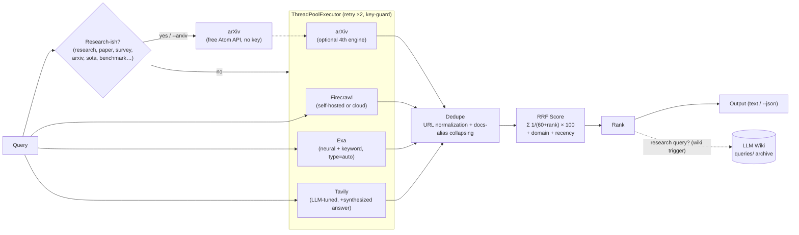

# LLM Smart Search

Multi-engine web search for AI agents and RAG pipelines — **Firecrawl + Exa + Tavily + arXiv in parallel, fused via Reciprocal Rank Fusion (RRF), scored, and ranked**, with a synthesized one-line answer on top.

One Python script. Zero pip dependencies (stdlib only, Python 3.8+). Built to run inside [Hermes Agent](https://hermes-agent.nousresearch.com) sessions, cron jobs, or any pipeline where a single search engine misses too much.

## Why

Any single search engine has blind spots — niche sources, deep-web pages, semantically-related-but-different phrasing, and (for most web engines) academic papers. This tool fans one query out to up to four engines simultaneously, then cross-confirms results: a URL returned by multiple engines is almost always the authoritative source.



**v2.2.0 highlights**

- **arXiv engine** — research papers via the free public `export.arxiv.org` Atom API, no API key required. Auto-enabled for research-oriented queries; `--arxiv` / `--no-arxiv` flags or `ARXIV_ALWAYS=1` env override.
- **RRF scoring** — replaces hand-tuned engine-agreement weights with Reciprocal Rank Fusion (k=60, Cormack et al. 2009), the same fusion method shipped by Elasticsearch, OpenSearch, and MongoDB for hybrid search. Tuning-free and uses each engine's full rank list.
- **Engine registry** — engines live in an `ENGINES` list; adding a new one is a one-liner.
- **Reliability** — clear "key not set" errors instead of raw `KeyError`; stderr warning when fewer than 2 engines return results; friendly usage error (exit code 2) on invalid `MAX_RESULTS`.

## Quick Start

```bash
# Basic usage (text output)
python3 scripts/search.py "query" [max_results]

# Machine-readable output for pipelines / cron jobs
python3 scripts/search.py "query" 10 --json

# Force / disable the arXiv engine
python3 scripts/search.py "kubernetes autoscaling" 5 --arxiv
python3 scripts/search.py "llm routing survey" 5 --no-arxiv
```

### arXiv engine (research papers)

Queries that look research-oriented — containing *research*, *paper*, *survey*, *arxiv*, *literature*, *state of the art*, *sota*, or *benchmark* — automatically add **arXiv** as a fourth engine. Free, no API key. Override with `--arxiv` / `--no-arxiv`, or set `ARXIV_ALWAYS=1` to always include it.

```bash
python3 scripts/search.py "retrieval augmented generation survey" 10   # arXiv auto-included
python3 scripts/search.py "best pizza in rome" 5                       # arXiv excluded
```

## Research Archiving (LLM Wiki)

Queries containing **"research"** or **"deep research"** (case-insensitive, word-boundary matched) are automatically archived to a [Karpathy-style LLM Wiki](https://gist.github.com/karpathy/442a6bf555914893e9891c11519de94f) — normal searches are never archived.

- **Location:** `WIKI_PATH` env var (default `~/wiki`)
- **What's written:** a page under `queries/` with YAML frontmatter (title, dates, type, tags, source URLs), the synthesized answer, and all ranked results with scores/engine agreement; plus an `index.md` entry and a `log.md` append
- **No clobbering:** repeat runs of the same query create `slug-2.md`, `slug-3.md`, …
- **Best-effort:** wiki write failures print a warning to stderr and never break search output
- **JSON mode:** adds an `archived_to_wiki` field (file path or `null`)
- **Overrides:** `--wiki` forces archiving, `--no-wiki` disables it

```bash
# Archived (contains "research")
python3 scripts/search.py "deep research on LLM routing strategies" 10

# NOT archived (normal query)
python3 scripts/search.py "best pizza in rome" 5

# Force / disable
python3 scripts/search.py "LLM routing" 5 --wiki
python3 scripts/search.py "research notes query" 5 --no-wiki
```

### API keys

Set these in your environment or `~/.hermes/.env` (the script's built-in env loader reads it automatically, with a `/root/.hermes/.env` fallback for sandboxed shells):

| Variable | Notes |
|---|---|
| `FIRECRAWL_API_KEY` | Firecrawl key |
| `FIRECRAWL_API_URL` | Optional — defaults to `https://api.firecrawl.dev`; point at a self-hosted instance if you have one |
| `EXA_API_KEY` | api.exa.ai |
| `TAVILY_API_KEY` | api.tavily.com |
| `ARXIV_ALWAYS` | Optional — set to `1` to always include the arXiv engine (no key needed) |

Engines whose key is missing are skipped with a clear error message in `errors` instead of crashing.

## Scoring Model (v2.2 — Reciprocal Rank Fusion)

Results are fused with **RRF** (Cormack et al., 2009) — the same method shipped by Elasticsearch, OpenSearch, and MongoDB for hybrid search:

```
score = Σ_engines 1/(60 + rank) × 100   + small domain-quality & recency bonuses
```

| Signal | Weight | Notes |
|---|---|---|
| **RRF** | dominant | Tuning-free; uses each engine's full rank list |
| **Domain quality** | ±0.1–0.4 | Authoritative domains (arxiv, github, docs.\*) vs medium vs low-signal |
| **Recency** | +0.10 / +0.05 | < 90 days / < 1 year |
| **Snippet length** | tie-break | Longer snippet wins during merge |

**Score guide (RRF):** rank 1 in a single engine ≈ 1.6 · two engines agreeing ≈ 3+ · top of all engines ≈ 5+. Relative order matters, not the absolute number. (Pre-v2.2 scores of 30+/20–29/12–19 used hand-tuned engine-agreement weights.)

## Deduplication

URLs are normalized (lowercase netloc, trailing slash stripped, query/fragment ignored), plus **docs-alias collapsing**:

- `/docs/18/…` ≡ `/docs/current/…` ≡ `/docs/latest/…` → merged as one result
- Conservative: version segments only collapse after docs-style segments (`docs`, `api`, `reference`, `guide`, `wiki`, `learn`)
- Content-bearing versions stay separate: `/blog/pg-18-tuning` ≠ `/blog/pg-19-tuning`

## JSON Output Schema

```json
{
  "query": "...",
  "engines": ["firecrawl", "exa", "tavily", "arxiv"],
  "answer": "Tavily synthesized one-line answer",
  "raw": 24, "deduped": 18,
  "errors": [],
  "archived_to_wiki": null,
  "results": [
    {"url": "...", "title": "...", "snippet": "...",
     "engine": "exa", "rank": 0, "date": "2026-03-17",
     "engines": ["exa", "tavily"], "best_rank": 0,
     "engine_ranks": {"exa": 0, "tavily": 2}, "score": 3.55}
  ]
}
```

`engine_ranks` (new in v2.2) records each engine's own ranking of the result — the input to RRF.

## Exit Codes

| Code | Meaning |
|---|---|
| 0 | Search completed (engines may still be listed in `errors`) |
| 2 | Usage error — empty query, or `MAX_RESULTS` not an integer in 1–50 |

## Documentation

- [`docs/MULTI_ENGINE_SEARCH_v2.md`](docs/MULTI_ENGINE_SEARCH_v2.md) — full skill documentation (architecture, scoring, dedup rules, A/B test results)
- [`docs/MULTI_ENGINE_SEARCH_v2_INSTALL.md`](docs/MULTI_ENGINE_SEARCH_v2_INSTALL.md) — single-file installable package (docs + complete source)
- [Release v2.2.0](https://github.com/david6055my/llm-smart-search/releases/tag/v2.2.0) — arXiv engine + RRF scoring changelog

## Install as a Hermes Agent skill

1. `mkdir -p ~/.hermes/skills/research/llm-smart-search/scripts`
2. Copy `scripts/search.py` into it
3. Add the 3–4 API keys to `~/.hermes/.env` (arXiv needs none)
4. Verify: `python3 scripts/search.py "test query" 5`

## License

MIT
